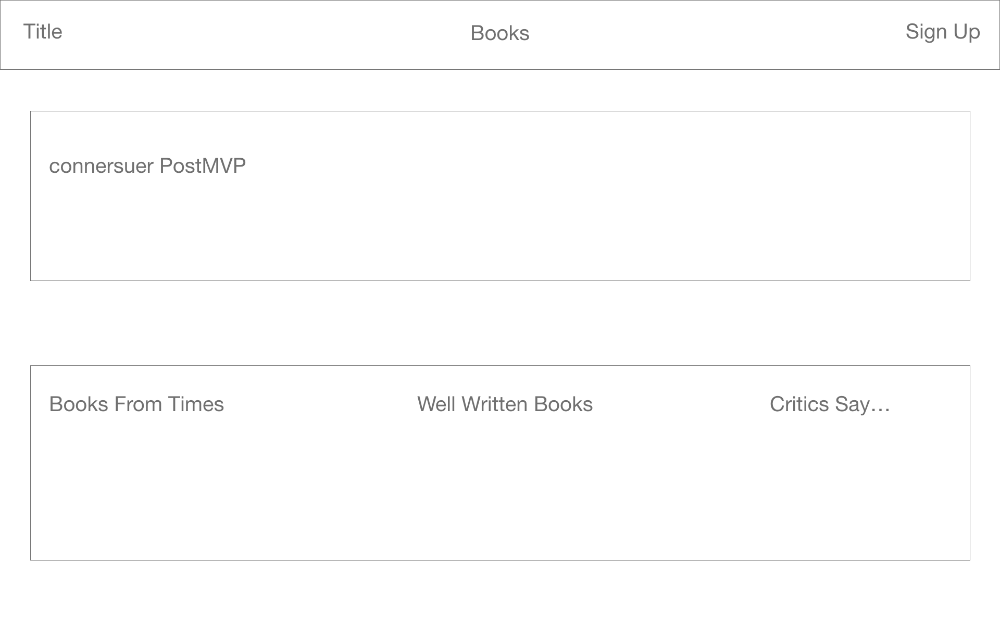

# Book_App

1. This project displays the books that are held with high praise. There will be 3 pages of this site, the loading screen, the books and the book detail. This site will contain authenication and other MVP/ PostMVP parts to it. The site will also be responsive.

2. Adobe XD

3. Component Hierarchy

[Whimsical](https://whimsical.com/book-app-EpvW2Vm6tWkbB66G3oUeei)

4. Backend sample 

{
  title: "To Kill A Mockingbird",
  author: "Harper Lee",
  publisher: "Penguin",
  publicationYear: 1963,
  price: 17.05
}

5. MVP/ PostMVP

MVP 

The site will have a authenication on the right hand corner.

PostMVP

The site will contain a connersuer
Write Reviews

6. Project Schedule 

| Day    |          Deliverable        |   Status   |
| ------ | --------------------------- | ---------- |
| Jan 4  |  Project Approval           | Complete   |
| Jan 5  |  Backend Development        | Incomplete |
| Jan 6  |  Components setups/ Styling | Incomplete |
| Jan 7  |  Functionality / Styling    | Incomplete |
| Jan 8  |  PostMVP/ MVP Styling       | Incomplete |
| Jan 9  |  Debugging                  | Incomplete |

7. Timeframes 

| Component  |  P  |  ET   |  Time Invested  |  Actual Time  |
| ---------- | --- | ------| ----------------| ------------- |
| Components |  H  |  4hrs |        hrs      |       hrs     |
| Functions  |  H  |  4hrs |        hrs      |       hrs     |
| Loading S  |  H  |  4hrs |        hrs      |       hrs     |
| Book S     |  H  |  4hrs |        hrs      |       hrs     |
| Book Detail|  H  |  4hrs |        hrs      |       hrs     |
| MVP        |  H  |  4hrs |        hrs      |       hrs     |
| PostMVP    |  H  |  4hrs |        hrs      |       hrs     |
| StylingCom |  H  |  4hrs |        hrs      |       hrs     |
| StylingL/B |  H  |  4hrs |        hrs      |       hrs     |

Strengths:

I'm well rounded with what it takes to be a Full Stack Project

Weaknesses: 

If I dont find a solution to the problems, I panic for a good amount of time.

Opportunities: 

I get to really explore to what takes to be a full stack developer.

Threats:

I can hold myself back at times.